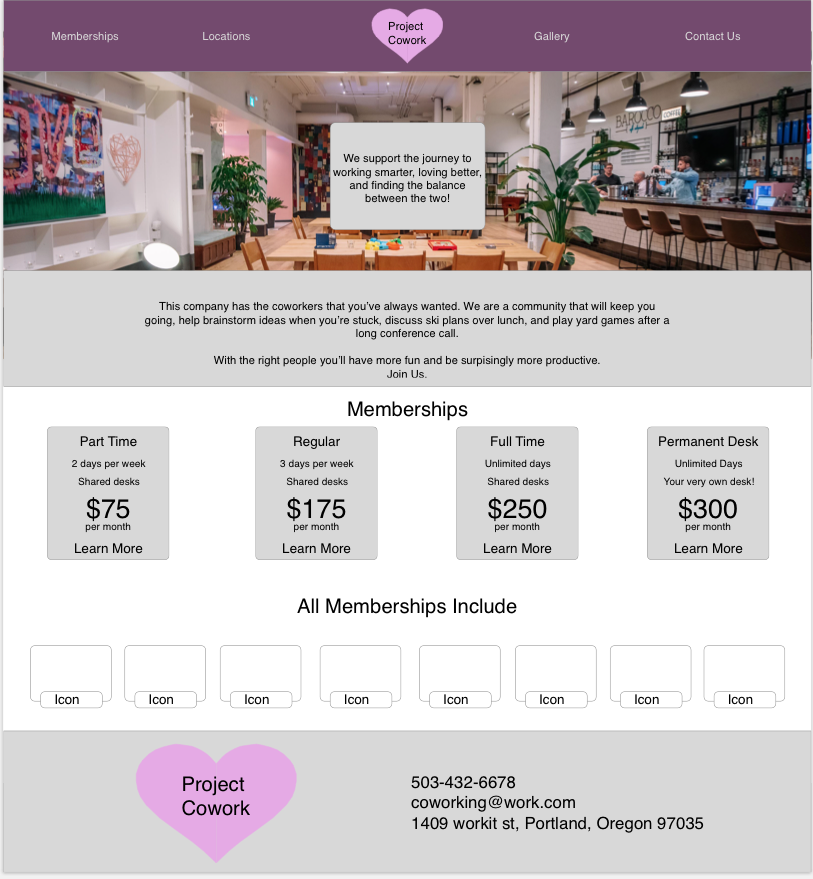
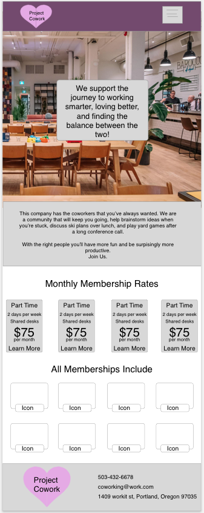
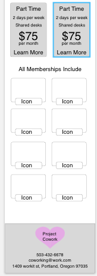
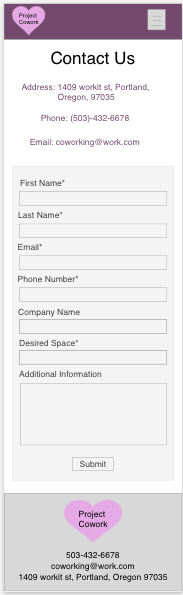
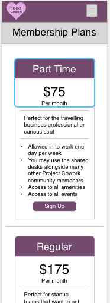

# _Freelance Coworking Contract_

#### _This is a website for a coworking company that provides users with information about the company, 2019_

#### By _**Riley Benson**_

## Description

_This project is a website for a new co-working company that has come to town. This website displays everything about the companies workspace, including, contact information, included amenities, cost, subscription and membership model, and how to join the workspace._

## User Personas

##_Dan_
*_"I need a new workspace for my new start up company"_
* _Needs:_
  * _A space other than their home to avoid distractions, focus, and be productive while working_
  * _Competitive cost_
  * _Amenities such as printers and fast wi-fi_
* _Pain Points:_
  * _Monthly cost_
  * _Privacy_
  * _Amenities, such as fast wi-fi and printers_
* _How we can serve:_
  * _Provide competitive cost_
  * _Provide private rooms he can reserve for privacy or meetings_
  * _Fast wi-fi and other office amenities_

  ##_Linda_
  *_"I'm a college student in need of a workspace to code in my free time"_
  * _Needs:_
    * _A space other than their home to avoid distractions, focus, and be productive while working_
    * _Competitive cost_
    * _Amenities such as fast wi-fi_
  * _Pain Points:_
    * _Monthly cost_
    * _Privacy_
    * _Amenities, such as fast wi-fi_
  * _How we can serve:_
    * _Provide competitive cost_
    * _Fast wi-fi and other office amenities_

    ##_Steve_
    *_"I need a workspace that I can consistently come to"_
    * _Needs:_
      * _A space other than their home to avoid distractions, focus, and be productive while working_
      * _Competitive cost_
      * _Amenities such as printers and fast wi-fi_
    * _Pain Points:_
      * _Monthly cost_
      * _Private desk and office_
      * _Amenities, such as fast wi-fi and printers_
    * _How we can serve:_
      * _Provide competitive cost_
      * _Provide an option to have his own desk and office_
      * _Fast wi-fi and other office amenities_

## Sketches
        

## Wireframes
       

## Setup/Installation Requirements

* _Clone this repository from Github_
* _Open the application in your preferred text editor_
* _Open your terminal or Git Bash_
* _Run the command "npm install" in your terminal or Git Bash(You must have node.js installed)_
* _Open the applicationin your preferred web browser or run the command "webpack-dev-server --mode development --open" in your terminalor Git Bash_

## Known Bugs

_As of now all the media queries are not in place so it does not expand and shrink well with the web window._

## Support and contact details

_Contact ryguybenson@yahoo.com with any questions or to contribute to this application_

## Technologies Used

_HTML, CSS, Webpack, SASS, and Sketch were used to complete this application_

### MIT License

Copyright (c) [2019] [Riley Benson]

Permission is hereby granted, free of charge, to any person obtaining a copy
of this software and associated documentation files (the "Software"), to deal
in the Software without restriction, including without limitation the rights
to use, copy, modify, merge, publish, distribute, sublicense, and/or sell
copies of the Software, and to permit persons to whom the Software is
furnished to do so, subject to the following conditions:

The above copyright notice and this permission notice shall be included in all
copies or substantial portions of the Software.

THE SOFTWARE IS PROVIDED "AS IS", WITHOUT WARRANTY OF ANY KIND, EXPRESS OR
IMPLIED, INCLUDING BUT NOT LIMITED TO THE WARRANTIES OF MERCHANTABILITY,
FITNESS FOR A PARTICULAR PURPOSE AND NONINFRINGEMENT. IN NO EVENT SHALL THE
AUTHORS OR COPYRIGHT HOLDERS BE LIABLE FOR ANY CLAIM, DAMAGES OR OTHER
LIABILITY, WHETHER IN AN ACTION OF CONTRACT, TORT OR OTHERWISE, ARISING FROM,
OUT OF OR IN CONNECTION WITH THE SOFTWARE OR THE USE OR OTHER DEALINGS IN THE
SOFTWARE.
